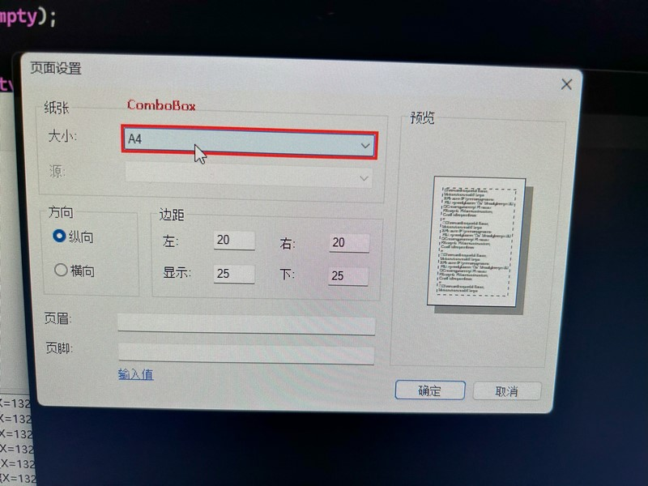

# UI Recorder

UI Recorder 是一个基于 .NET 8 开发的UI自动化测试工具，它支持元素高亮显示和操作回放。目前，它已经支持通过UI Automation (UIA) 来识别和高亮显示用户界面元素，未来将支持更多的迭代功能。

## 功能特性

- **元素高亮**：实时高亮显示用户界面上的元素，帮助开发者快速定位。
- **操作回放**：录制用户对UI元素的操作，并能够回放这些操作。
- **进程关联**：与特定进程关联，确保高亮和操作仅针对目标应用程序。

## 屏幕截图

以下是UI Recorder的使用截图：

## 代码概览

以下是UI Recorder主要代码组件的简要说明：

- **WindowsHighlightRectangle**：负责在屏幕上绘制高亮矩形的类。
- **WindowsHighlightBehavior**：定义了高亮行为，包括鼠标移动事件处理器的注册和取消注册。

## 使用说明

1. 运行UI Recorder应用程序。
2. 使用提供的按钮来控制高亮行为的启动、停止、暂停和恢复。
3. 鼠标移动到UI元素上时，会自动高亮显示该元素，并在日志列表中记录相关信息。

## 贡献指南

我们欢迎任何形式的贡献。如果您想要参与开发，请遵循以下步骤：

1. Fork 本项目。
2. 创建一个新的分支 (`git checkout -b feature-branch`)。
3. 提交您的更改 (`git commit -am "Add some feature"`)。
4. 推送到分支 (`git push origin feature-branch`)。
5. 创建一个新的 Pull Request。

## 许可证信息

本项目遵循 [MIT License](LICENSE)。

## 联系方式

如有问题或建议，欢迎通过以下方式联系我们：

- Email: [yan.zhiwei@hotmail.com](mailto:yan.zhiwei@hotmail.com)
- GitHub Issues: https://github.com/YanZhiwei/UIRecorder/issues
